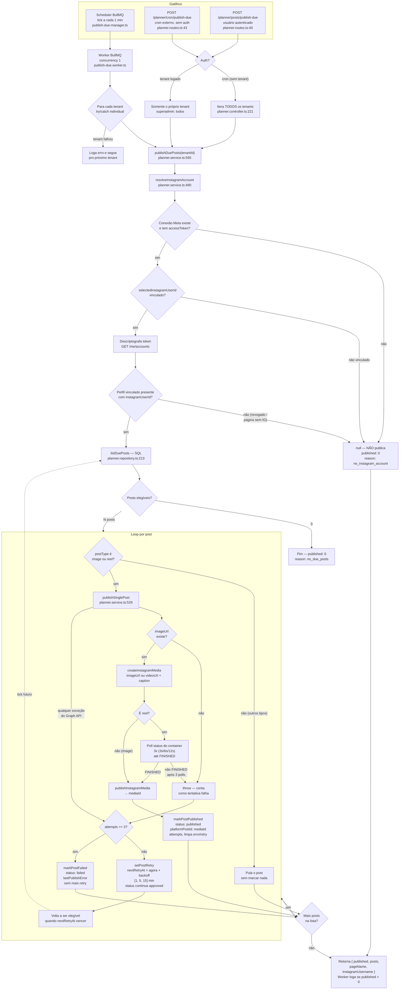

# Fluxograma — Agendador de Postagens (publish-due)

> Fonte: código real (`apps/api`). Última revisão: 2026-09, branch `chore/calendario-planejamento`.
> Responsável por publicar automaticamente os posts aprovados do calendário quando chega a hora agendada.

## Visão geral

- **Scheduler**: enfileira 1 "tick" por minuto no BullMQ (`* * * * *`), fila `publish-due` — `apps/api/src/lib/publish-due-manager.ts:11`
- **Worker**: processa o tick com **concurrency 1** (um tick por vez), itera **todos os tenants** e chama `publishDuePosts(tenantId)` — falha de um tenant não derruba os demais (try/catch por tenant) — `apps/api/src/workers/publish-due.worker.ts:12`
- **Service**: `publishDuePosts` no `PlannerService` resolve a conta Instagram, lista os posts vencidos e publica um a um — `apps/api/src/services/planner/planner.service.ts:565`

## Fluxograma

## Regras de elegibilidade (`listDuePosts`)

Query SQL em `apps/api/src/repository/planner.repository.ts:213` — um post só entra na lista se **todas**:

| Condição | Campo |
|---|---|
| Do tenant | `tenantId` |
| Tem agendamento | `scheduledAt IS NOT NULL` |
| Hora chegou | `scheduledAt <= now` |
| Aprovado | `status = 'approved'` |
| Retry vencido ou nunca tentou | `nextRetryAt IS NULL OR nextRetryAt <= now` |

Filtro extra **fora do SQL**: só `postType = 'image' | 'reel'` são publicáveis (checado no loop do service) — outros tipos são pulados sem alterar status.

## Retry e backoff

| Tentativa (attempts) | Se falhar | Próxima tentativa |
|---|---|---|
| 1 | `setPostRetry` | +1 min |
| 2 | `setPostRetry` | +5 min |
| 3 | `markPostFailed` — estado final | sem retry |

- `attempts` incrementa a cada tentativa (`publishAttempts`).
- Enquanto espera retry, o post **continua `approved`** — volta a ser elegível sozinho no tick seguinte ao vencer `nextRetryAt`.
- Exaustão = `status: 'failed'` + `lastPublishError` com a mensagem da Graph API.
- Sucesso = `status: 'published'` + `platformPostId` (id do media no Instagram) + `publishedAt`.

## Falha segura — conta do Instagram (`resolveInstagramAccount`)

Fonte de verdade: `meta_connections.selected_instagram_user_id`, gravado **server-side** no save-selection. Qualquer dessas condições ⇒ **não publica nada do tenant** (retorna `null`, `published: 0`):

1. Sem conexão Meta ou sem `accessToken`.
2. Sem `selectedInstagramUserId` (perfil nunca vinculado) — publica em NINGUÉM, nem em outra conta disponível.
3. Perfil vinculado não aparece em `/me/accounts` com Instagram (revogado, página sem IG).

> Histórico: o antigo fallback `pagesWithIg[0]` ("primeira página com IG") publicava em conta errada (bug velora_studio → jeanvdentz, 2026-09). Foi removido de propósito — sem vínculo explícito = não executa.

## Arquivos envolvidos

| Arquivo | Papel |
|---|---|
| `apps/api/src/lib/publish-due-manager.ts` | Sobe scheduler + worker; agenda o tick `* * * * *` |
| `apps/api/src/lib/queue.ts` | Nome/fila BullMQ `publish-due` |
| `apps/api/src/workers/publish-due.worker.ts` | Tick → itera tenants → `publishDuePosts` |
| `apps/api/src/services/planner/planner.service.ts` | `publishDuePosts` (:565), `resolveInstagramAccount` (:480), `publishSinglePost` (:529) |
| `apps/api/src/repository/planner.repository.ts` | `listDuePosts` (:213), `markPostPublished` (:225), `markPostFailed` (:240), `setPostRetry` (:253) |
| `apps/api/src/controllers/planner.controller.ts` | Trigger manual/cron `handlePublishDue` (:218) |
| `apps/api/src/routes/planner.routes.ts` | Rotas `:40` (auth) e `:43` (cron sem auth) |

## Observações operacionais

- **Concurrency 1**: ticks não concorrem entre si; um tick longo atrasa o seguinte (não há sobreposição de execução do mesmo tenant).
- **Cron sem auth** (`/cron/publish-due`): protegido pela infraestrutura (API key no gateway), não por middleware de tenant — publica TODOS os tenants.
- **Logs**: `[publish-due]` (worker), `[publishDuePosts]` (service), `[resolveInstagram]` (vínculo/segurança). Publicação em conta errada aparecia só como divergência nos logs `[resolveInstagram]` — hoje bloqueada pelo vínculo explícito.
- Post sem `imageUrl` no momento do publish: lança erro e entra no fluxo normal de retry/falha.
