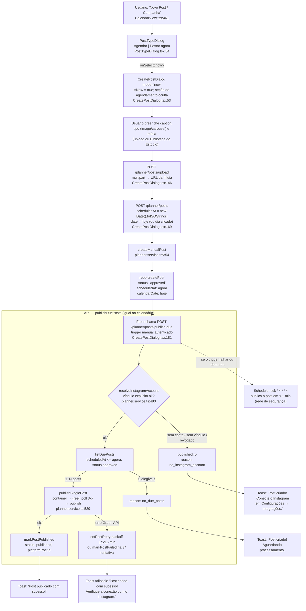

# Fluxograma: "Postar agora" (publicação imediata, sem agendamento)

> Fonte: código real (2026-09), branch `chore/calendario-planejamento`. Complemento de `docs/fluxograma-agendador-postagens.md`.
>
> **TL;DR**: "Postar agora" NÃO tem endpoint próprio de publicação. O front cria o post já com `scheduledAt = agora` e dispara o **mesmo pipeline publish-due** do calendário. Se o trigger falhar, o scheduler de 1 min publica igual (rede de segurança natural).

## Pontos-chave

| Aspecto | Valor |
|---|---|
| Endpoint de criação | `POST /planner/posts` (mesmo do agendado) |
| Segredo do "agora" | `scheduledAt: new Date().toISOString()` — post nasce **vencido**, ou seja, elegível na hora |
| Status inicial | `approved` direto (post manual pula aprovação — decisão de produto) |
| Trigger de publicação | `POST /planner/posts/publish-due` autenticado (só o tenant do usuário) |
| Pipeline usado | `publishDuePosts(tenantId)` — idêntico ao do scheduler de 1 min |
| Fallback | Se o trigger manual falhar, o próximo tick do scheduler (≤ 1 min) publica o post |

## Fluxograma

## Mensagens ao usuário (`CreatePostDialog.tsx:182-197`)

A resposta do trigger mapeia `reason` → toast:

| Condição da resposta | Toast |
|---|---|
| `published > 0` | "Post publicado com sucesso!" |
| `reason = no_instagram_account` | "Post criado! Conecte o Instagram em Configurações → Integrações." |
| `reason = no_due_posts` | "Post criado! Aguardando processamento." |
| `reason = publish_failed` | "Post criado, mas a publicação falhou. Verifique o token do Meta…" |
| outro (sem reason) | "Post criado com sucesso! Verifique a conexão com o Instagram." |
| request falhou (catch) | "Post criado com sucesso! Não foi possível publicar agora." |

## O que acontece se nada disparar

Nada quebra: o post nasce com `scheduledAt <= agora` e `status = 'approved'`, então **o scheduler de 1 minuto o publica mesmo sem o trigger manual**. O trigger é otimização de latência (publicar na hora vs. esperar até 60s), não um caminho separado. O mesmo vale para retry: falha na 1ª tentativa → `nextRetryAt = +1 min` → tick seguinte tenta de novo, automaticamente.

## Gaps conhecidos (candidatos a correção — planejamento do calendário)

1. **`publish_failed` nunca é emitido pela API.** O controller devolve o `result` cru do service (`{published, posts, pageName, instagramUsername}`), que não tem `reason: 'publish_failed'` em nenhum caminho. Quando o post falha na publicação (erro da Graph API), o front cai no `else` genérico "Verifique a conexão com o Instagram" — mensagem enganosa (o problema pode ser outro). Fix provável: controller derivar `reason: 'publish_failed'` quando `published < elegíveis`.
2. **Carrossel em "Postar agora" nunca publica.** As opções do dialog manual são `image` e `carousel` (não há reel), mas o filtro do publish só aceita `image`/`reel` (`planner.service.ts:588`). Post carrossel criado → pulado silenciosamente no loop, sem retry, sem status de erro, **nem pelo scheduler**. `published: 0` → toast genérico errado.
3. **Corrida entre trigger manual e tick do scheduler.** Não há claim/lock entre eles: `listDuePosts` é um `findMany` simples (sem `FOR UPDATE SKIP LOCKED`), o worker tem concurrency 1 entre ticks, mas o trigger HTTP **não passa pela fila**. Dois processos podem listar o mesmo post e publicar duas vezes no Instagram. Janela pequena (tick de 1 min), mas real.
4. **Posts manuais nascem `approved`** (sem etapa de revisão/aprovação) — intencional hoje, mas vale registrar como decisão de produto.

## Arquivos envolvidos

| Arquivo | Papel |
|---|---|
| `apps/web/src/pages/planejador/components/PostTypeDialog.tsx` | Diálogo "Agendar \| Postar agora" |
| `apps/web/src/pages/planejador/components/CreatePostDialog.tsx` | Form; `mode='now'`; payload com `scheduledAt=agora` (:169-176); mensagens (:178-201) |
| `apps/web/src/pages/planejador/components/CalendarView.tsx` | Entra no dialog com `mode` (:610-620) |
| `apps/api/src/controllers/planner.controller.ts` | `handleCreatePost` e `handlePublishDue` (:218) |
| `apps/api/src/services/planner/planner.service.ts` | `createManualPost` (:354, status `approved` :405) → `publishDuePosts` (:565) |
| `apps/api/src/routes/planner.routes.ts` | `:37` create, `:40` publish-due (auth) |
