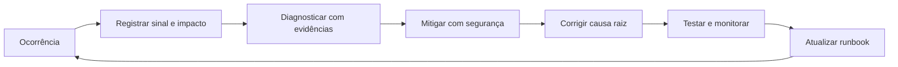

# Conhecimento operacional

Este diretório registra problemas recorrentes e a forma segura de lidar com eles.
Ele complementa o [guia de ambiente local](../TROUBLESHOOTING.md): aquele resolve
problemas de inicialização; este guia explica como diagnosticar, mitigar e evitar
recorrências no produto e na operação.

## Fundamentação

O sistema combina práticas de gestão do conhecimento, KCS (*Knowledge-Centered
Service*), SRE e resposta a incidentes. A ideia é transformar experiência tácita
de incidentes em procedimentos verificáveis, reduzir primeiro o impacto e depois
eliminar a causa raiz. A revisão periódica cria aprendizado organizacional: uma
mitigação repetida deve evoluir para automação, monitoramento ou teste de
regressão.

| Prática | Aplicação neste diretório |
|---|---|
| Gestão do conhecimento | Runbooks registram diagnóstico, ação e evidência reutilizáveis. |
| KCS | Resolver uma recorrência atualiza a base no mesmo fluxo de trabalho. |
| SRE e incidentes | Sinal, impacto, mitigação, causa raiz e retorno ao serviço ficam separados. |
| Confiabilidade | Prioridade, testes e automação reduzem reincidência mensurável. |
| Aprendizado organizacional | Dono e revisão trimestral mantêm os procedimentos corretos e atuais. |

O registro sempre diferencia **sintoma**, **mitigação** e **correção definitiva**.
Por exemplo, limitar um teste a usuários com função no aplicativo Meta reduz o
impacto imediato; obter a permissão exigida e adequar o status do aplicativo trata
a condição que impedia o fluxo.

## Quando criar ou atualizar um registro

Crie um registro quando um problema ocorrer mais de uma vez, tiver impacto alto
em uma única ocorrência, ou exigir conhecimento que não esteja explícito no código.
Atualize-o no mesmo PR que corrige a causa ou quando uma evidência nova mudar o
diagnóstico. Um incidente isolado sem padrão pode ficar somente no ticket.

## Matriz de recorrências levantada em 2026-07-09 a 2026-10-09

| Área | Sinais recorrentes | Prioridade | Runbook |
|---|---|---:|---|
| Meta, OAuth e permissões | reconexão, escopo ausente, conta/página incorreta | P1 | [Meta e OAuth](runbooks/meta-oauth.md) |
| Sincronização, cache e workers | dados defasados, fila duplicada, falha parcial | P1 | [Sincronização e workers](runbooks/sync-workers.md) |
| Publicação e planejador | erro 9007, post duplicado, job preso | P1 | [Publicação e planejador](runbooks/publicacao-planejador.md) |
| Banco e isolamento de tenant | migration ausente, schema divergente, dado cruzado | P1 | [Banco e tenant](runbooks/banco-tenant.md) |
| CI, dependências e deploy | build falha, lockfile divergente, imagem sem migration | P1 | [CI e deploy](runbooks/ci-deploy.md) |
| Interface assíncrona | vazio confundido com erro, tela presa, refresh agressivo | P2 | [Interface assíncrona](runbooks/ui-assincrona.md) |

P1 impede uma operação crítica, causa risco de integridade ou afeta múltiplos
tenants. P2 mantém um caminho alternativo, mas confunde, atrasa ou degrada a
experiência. A prioridade deve ser reavaliada quando o impacto mudar.

## Ciclo operacional



## Sequência de atendimento

1. Registre o sintoma observável, o tenant afetado, horário com fuso e o fluxo
   executado. Não registre token, payload pessoal, senha ou stack trace em texto
   visível ao cliente.
2. Abra o runbook da área e execute primeiro apenas os passos de leitura.
3. Aplique a mitigação indicada e valide o critério de retorno ao serviço.
4. Abra ou vincule um incidente/ticket para a causa raiz quando a mitigação não
   for uma correção permanente.
5. Atualize o runbook com a evidência, a causa confirmada e o teste que evita a
   regressão.

## Formato obrigatório para novas entradas

```md
### Título do problema

- **Sinal:** mensagem, métrica ou comportamento visível.
- **Impacto e prioridade:** quem é afetado e por quê.
- **Diagnóstico:** consultas, logs ou telas que confirmam a hipótese.
- **Mitigação:** ação reversível e o critério para parar.
- **Correção definitiva:** mudança de código/configuração e teste de regressão.
- **Evidências:** incidentes, commits, PRs e dashboards.
- **Dono e revisão:** time responsável; reavaliar em até 90 dias.
```

Não trate o assunto de um commit como causa raiz. Commits são evidência de que
o problema e uma correção existiram; a causa só é confirmada por logs, testes,
reprodução ou análise do código.

## Governança

- O dono do componente atualiza a entrada após uma correção ou incidente P1.
- A cada trimestre, remova mitigações obsoletas, confirme links e rebaixe itens
  que não ocorreram no período.
- Uma solução repetida manualmente por três vezes deve virar automação, alerta,
  teste ou procedimento executável.
- Toda mudança de comportamento em um runbook deve apontar para teste ou validação
  correspondente.

## Evidência do levantamento

Foram analisados 592 commits sem merge. Os grupos encontrados por assunto de
commit foram: Meta/campanhas/leads (101), autenticação/tenant (63), planejamento/
publicação (76), sincronização/jobs (49), testes/CI (174), interface (195) e
correções/recuperação (294). Esses grupos se sobrepõem e servem para priorização,
não como contagem de incidentes.
