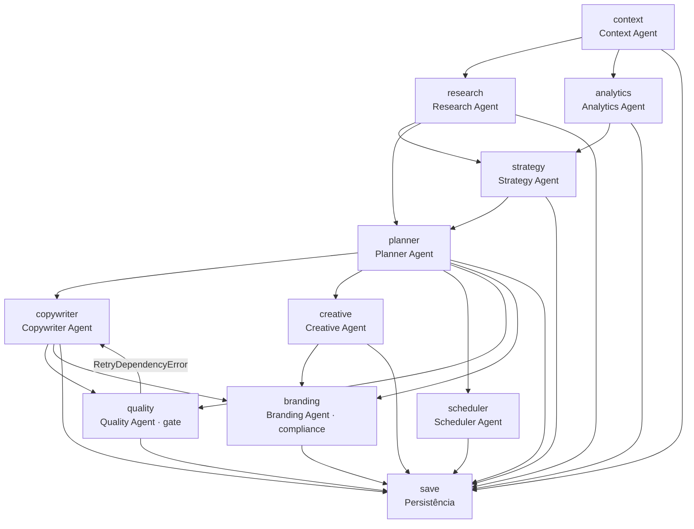

# Workflow: `planner-generate` — Planejamento de Conteúdo (IA)

Gera um **plano mensal de conteúdo** para um tenant usando uma cadeia de
agentes de IA. Cada agente é um stage da engine de workflows — o que garante
checkpoints, retry, rollback e recuperação.

- **ID do workflow**: `planner-generate`
- **Input**: `{ tenantId: string }`
- **Definição**: [`orchestrator.ts`](../../apps/api/src/agents/orchestrator.ts)
- **Runner**: [`planner-workflow-runner.ts`](../../apps/api/src/planner-workflow-runner.ts)
- **Fila**: BullMQ `planner-generate` (concurrency 1) — [`planner.worker.ts`](../../apps/api/src/workers/planner.worker.ts)

---

## Visão geral

```
POST /api/planner/generate  (auth)
        │
        ▼
startPlanGeneration(tenantId)
  ├─ lockKey check  ──409 se já existe job ativo──► CONFLICT
  ├─ cria job em workflow_jobs (status=pending)
  └─ enqueuePlanGeneration(jobId) → fila BullMQ
        │  (se enfileirar falhar: executa inline no service)
        ▼
planner.worker (concurrency 1)
        │
        ▼
runPlannerWorkflow(jobId, tenantId)
  └─ WorkflowEngine.run(jobId, { tenantId }, { resume })
        │
        ▼
  11 stages executados em ordem (DAG por deps)
        │
        ▼
finalize → markDone(job) → planId
        │
GET /api/planner/jobs/:jobId  (polling de progresso do frontend)
```

---

## Pré-requisitos (validados pelo frontend via `/api/planner/prerequisites`)

| Check | Retorna `false` se |
|-------|--------------------|
| `metaConnected` | Sem conexão Meta válida (token expirado ou nenhuma página selecionada) |
| `hasProduct` | `clientGoals.mainProduct` vazio |
| `hasObjective` | `clientGoals.objective` vazio |
| `hasVoiceTone` | `brandKits.voiceTone` vazio |

---

## Os 11 stages

Ordem topológica derivada das `deps`. Setas indicam dependências:



### 1. `context` — Context Agent

- **deps**: nenhuma
- **Entrada**: `tenantId`
- **Saída**: `context` (`AgentContext`) — dados do tenant, brand kit, objetivos

### 2. `research` — Research Agent

- **deps**: `context`
- **Entrada**: `context`
- **Saída**: `research` — trends, datas comemorativas, tópicos do nicho

### 3. `analytics` — Analytics Agent

- **deps**: `context`
- **Entrada**: `context`
- **Saída**: `analytics` — melhores formatos, dias e dicas de engajamento

### 4. `strategy` — Strategy Agent

- **deps**: `research`, `analytics`
- **Entrada**: `context`, `research`, `analytics`
- **Saída**: `strategy` — objetivo, pilares de conteúdo (com %), tom, persona

### 5. `planner` — Planner Agent

- **deps**: `research`, `strategy`
- **Entrada**: `context`, `research`, `strategy`
- **Saída**: `planner` — `totalPosts`, resumo (reels/carousel/image/stories) e lista de posts (dia, tipo, plataforma, pilar, categoria)
- **Retry**: `{ maxAttempts: 3, backoffMs: 1000, exponential }`

### 6. `copywriter` — Copywriter Agent

- **deps**: `planner`
- **Entrada**: `context`, `planner`
- **Saída**: `copywriter` — para cada post: `caption`, `cta`, `hashtags`
- **Retry**: `{ maxAttempts: 3, backoffMs: 800, exponential }`

### 7. `creative` — Creative Agent

- **deps**: `planner`
- **Entrada**: `context`, `planner`
- **Saída**: `creative` — `imagePrompt` por post

### 8. `quality` — Quality Agent (quality gate)

- **deps**: `planner`, `copywriter`
- **Entrada**: `planner`, `copywriter`
- **Saída**: `quality` — `{ passed, checks[] }`
- **Retry**: `{ maxAttempts: 2, backoffMs: 500, fixed }`
- **Comportamento especial**: se `quality.passed === false`, lança
  `RetryDependencyError('copywriter', ...)`. A engine **re-executa o stage
  `copywriter`** (comita novo artefato) e retenta `quality`. Padrão
  reutilizável de gate de qualidade.

### 9. `scheduler` — Scheduler Agent

- **deps**: `planner`
- **Entrada**: `planner`
- **Saída**: `scheduler` — dias/plataformas agendados, status de aprovação

### 10. `branding` — Branding Agent (compliance)

- **deps**: `planner`, `copywriter`, `creative`
- **Entrada**: `context`, `planner`, `copywriter`, `creative`
- **Saída**: `branding` — `{ approved, notes?, violations? }`
- **Comportamento especial**: se `branding.approved === false`, lança
  `Error` (falha terminal do stage — job vai a `error`).

### 11. `save` — Persistência

- **deps**: todos os anteriores
- **Entrada**: todos os artefatos
- **Saída**: `planId` (string) — retornado por `savePlanToDb`
- **Efeito colateral**: insere `campaignPlans` (status `draft`) + `socialPosts`
- **Rollback**: deleta os `socialPosts` do plano e o `campaignPlans` criado
  (remove resíduos se algo falhar depois).

---

## `finalize` e resultado

Ao fim de todos os stages, o hook `finalize` extrai `planId` do artefato
`planId` e o job é marcado `done`. O frontend obtém o resultado via
`GET /api/planner/jobs/:jobId` (campo `planId`) e carrega o plano por
`GET /api/planner/plans/:planId`.

---

## Políticas de retry por stage

| Stage | `maxAttempts` | `backoffMs` | Tipo |
|-------|:-------------:|:-----------:|------|
| padrão (default) | 2 | 1000 | exponential |
| `planner` | 3 | 1000 | exponential |
| `copywriter` | 3 | 800 | exponential |
| `quality` | 2 | 500 | fixed |

---

## Progresso no frontend (`JobStatus`)

O adapter [`job-status-adapter.ts`](../../apps/api/src/agents/job-status-adapter.ts)
converte `WorkflowSnapshot` → `JobStatus` (contrato do frontend):

- `status`: `pending | running | generating | done | error`
- `currentAgent`: nome do agente ativo (mapeado do `currentStage`)
- `agentProgress[]`: 11 passos com `pending | running | completed | failed`
  (na ordem fixa dos agentes, não na ordem do DAG)
- `planId`: quando `done`
- `error`: mensagem da última falha
- `_recoverable`: `true` se há stages `COMMITTED` (pode ser retomado)

> **Nota**: o frontend web (`apps/web/src/pages/planejador`) é **intocado** —
> o contrato `JobStatus` foi preservado. A mudança foi 100% no backend.

---

## Falhas e recuperação

| Cenário | Comportamento |
|---------|---------------|
| IA falha em um stage (transient) | Retry com backoff da política do stage |
| Qualidade não passa (`quality`) | Re-executa `copywriter`, depois retenta `quality` |
| Compliance rejeita (`branding`) | Stage `FAILED` → rollback do stage → job `error` |
| Crash/restart do servidor | `recoverInterruptedPlannerWorkflows()` no boot retoma jobs `running`/`pending` antigos com `resume` |
| Worker falha na fila | BullMQ `attempts: 3` com backoff exponencial (nível da fila) |
| Tenant tenta gerar com job ativo | 409 `CONFLICT` (lock via `findActiveByLockKey`) |
| Rollback total | `engine.rollback` executa `rollback` dos stages `COMMITTED` em ordem reversa |

---

## Endpoints envolvidos

| Método | Rota | Função |
|--------|------|--------|
| `POST` | `/api/planner/generate` | Inicia o job (retorna `JobStatus`) |
| `GET` | `/api/planner/jobs/:jobId` | Polling de progresso |
| `GET` | `/api/planner/plans/:planId` | Plano gerado |
| `GET` | `/api/planner/plans/latest` | Último plano do tenant |
| `GET` | `/api/planner/prerequisites` | Pré-requisitos antes de gerar |
| `POST` | `/api/planner/plans/confirm` | Confirma plano (status `active`) |
| `POST` | `/api/planner/plans/revalidate` | Revalida plano (metadados) |

Rotas completas em [`planner.routes.ts`](../../apps/api/src/routes/planner.routes.ts).

---

## Testes

```bash
# Engine (retry, rollback, lock, adapter)
npx vitest run apps/api/src/__tests__/stateMachine/

# Controller + pré-requisitos
npx vitest run apps/api/src/__tests__/planner-controller.test.ts
npx vitest run apps/api/src/__tests__/planner-prerequisites.test.ts
```